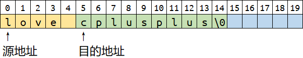
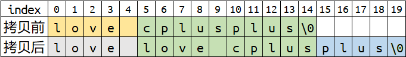
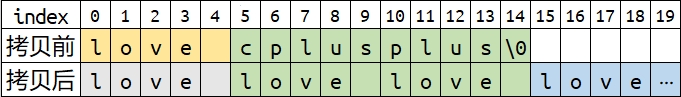

### 题目
> 不通过C语言标准库实现memcpy和strcpy函数

### 审题
这样的题目并不算难，但是往往简单的题目里面暗藏玄机。稍不谨慎就会掉入陷阱，而往往自己却还全然不知，沾沾自喜。从面试官的角度来看，越简单的问题，他越希望面试者能够回答得更加全面。因此，越是简单的问题就越要小心地处理。

大多数人拿到这个题目就能立刻写出这样的代码。
```c++

void *mymemcpy(void *to, const void *from, size_t size)
{
    assert(from && to);
    const char *tmp_from = from;
    char *tmp_to = to;
    while (size--)
        *tmp_to++ = *tmp_from++;
    return to;
}

char *mystrcpy(char *dst, const char *src)
{
    assert(dst && src);
    char *tmp = dst;
    while ((*dst++ = *src++) != '\0');
    return tmp;
}
```
乍一看很不错，首先判断输入合法性，然后从源地址向目的地址依次拷贝值，中间指针处理也没有瑕疵。一切都看似很完美。但是，他忽略了一个重要的问题——内存重叠。没有内存重叠则已，一旦发生内存重叠，这样的代码就会出大问题！

比如说，我们在一个足够大的字符数组中，将字符串 "love cplusplus" 从其开始处向后移动5个字符开始拷贝。



如你所见，源地址所指的内存空间和目的地址所指的内存空间是有重合的。

我们希望能够的到这样的结果。



但是却犯下了一个大错误，我们把原字符串内存重叠部分的内容覆盖了，甚至是结束符 `\0` 也被覆盖了，而这在 strcpy 中是致命的，会发生严重的数组越界。拷贝将无休止地执行下去，最终招致操作系统的段错误而退出。



可见，只想到从前往后依次拷贝，思维还不够严谨。这种方法只适用于目的地址在源地址前的情况。一旦源地址在目的地址前，而且拷贝区域有重叠的话，源中重叠部分会被当做目的地而直接被覆盖。这样一来，即便是声明了 const ，但是源地址所指的数据依然被污染了。

所以处理拷贝问题时，请一定要记得考虑内存重叠问题。就如我们在写 c++ 时经常会遇到的设计拷贝构造函数和拷贝赋值运算符重载时，要先判断是否为自我赋值一样，请一定要记得考虑内存重叠问题。

于是，我们总结一下可以得到发生内存重叠时的两种情况：
- 目的地址在源地址前发生内存重叠
- 目的地址在原地址后发生内存重叠

特别要注意目的地在源后时，应该从后往前拷贝，这种情况很容易被遗漏。

搞清楚了这些，代码就很好写了。

```c++
#include <stdio.h>
#include <assert.h>

char *mymemcpy(void *to, const void *from, size_t size)
{
    assert(from && to);
    const char *tmp_from = from;
    char *tmp_to = to;
    if (from > to)
        while (size--)
            *tmp_to++ = *tmp_from++;
    else if (from < to)
    {
        tmp_from += size;
        tmp_to += size;
        while (size--)
            *--tmp_to = *--tmp_from;
    }
    return to;
}

size_t mystrlen(const char *str)
{
    const char *p = str;
    while (*p++ != '\0');
    return (size_t)(p - str);
}

char *mystrcpy(char *dst, const char *src)
{
    assert(dst && src);
    return mymemcpy(dst, src, mystrlen(src) + 1);
}

int main(int argc, char const *argv[])
{
    //              "love love cplusplus"
    char name[20] = "love cplusplus";
    mystrcpy(name + 5, name);
    printf("%s", name);
    return 0;
}

```